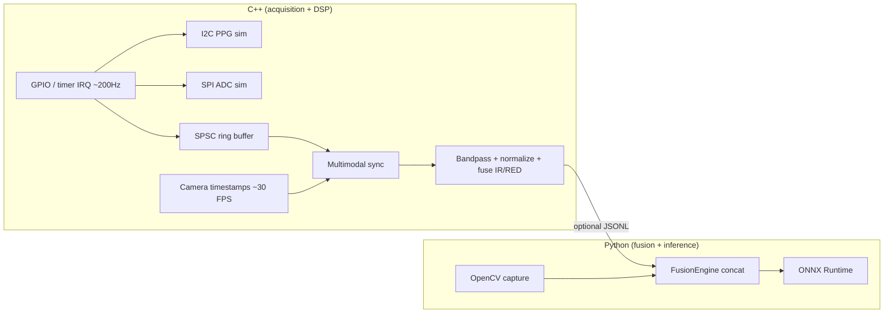

# Real-Time PPG Sensor Fusion & Health Inference

Production-oriented reference for a **Raspberry Pi 4** class edge node: **~200 Hz** simulated PPG (I2C/SPI path), **USB camera** hooks, **multi-threaded** acquisition and processing in **C++17**, and **sensor fusion + ONNX Runtime** inference in **Python**, with config-driven parameters and benchmark scripts.

[](https://cmake.org/)
[](./CMakeLists.txt)
[](./requirements.txt)
[](https://onnxruntime.ai/)

## Table of contents

- [1. Project overview](#1-project-overview)
- [2. System architecture](#2-system-architecture)
- [3. Sensor fusion strategy](#3-sensor-fusion-strategy)
- [4. Embedded design considerations](#4-embedded-design-considerations)
- [5. Pipeline flow](#5-pipeline-flow)
- [6. Raspberry Pi setup](#6-raspberry-pi-setup)
- [7. Build instructions](#7-build-instructions)
- [8. Run instructions](#8-run-instructions)
- [9. Benchmark results](#9-benchmark-results)
- [10. Demo instructions](#10-demo-instructions)
- [11. Limitations and future work](#11-limitations-and-future-work)
- [Repository layout](#repository-layout)
- [Testing](#testing)
- [Module reference](#module-reference)
- [CLI reference](#cli-reference)
- [Dependencies](#dependencies)
- [Evaluation metrics](#evaluation-metrics)
- [Design decisions & rationale](#design-decisions--rationale)
- [Performance & optimization](#performance--optimization)
- [Git conventions](#git-conventions)
- [Supplementary documentation (`READ.md`)](#supplementary-documentation-readmd)
- [License](#license)

## 1. Project overview

The stack demonstrates:

- **C++:** GPIO-timed acquisition (`InterruptSource`), simulated PPG front-end (I2C/SPI FIFOs), **SPSC ring buffer**, **multimodal time alignment**, and **bandpass + z-score + windowing**.
- **Python:** Same-domain preprocessing for parity tests, **late fusion** (PPG window + compact visual descriptor), **ONNX** MLP classifier (stub weights for CI; replace with trained model).
- **Real-time posture:** Four logical threads (sensor, camera, processing, inference), bounded queues, and explicit latency logging vs a **&lt;50 ms** inference budget (achievable on desktop CPU for the stub MLP; Pi requires ORT tuning / quantization—see benchmarks).

## 2. System architecture



### Multi-stage processing view (analogous layered pipeline)

The following ASCII overview mirrors a **layered pass-style** narrative (similar in spirit to multi-pass pipelines in [`READ.md`](./READ.md)): each stage has a clear contract and bounded responsibility.

```
┌─────────────────────────────────────────────────────────────────────────┐
│              MULTIMODAL PPG + VISION → HEALTH INFERENCE                 │
│                                                                         │
│  ┌──────────────┐   ┌──────────────┐   ┌─────────────────────────────┐  │
│  │  PASS A      │   │  PASS B      │   │  PASS C (deterministic)     │  │
│  │  Acquisition │ → │  DSP + sync  │ → │  Windowing + timestamp     │  │
│  │  ~200 Hz IRQ │   │  bandpass,   │   │  alignment + skew gate      │  │
│  │  I2C/SPI sim │   │  z-score     │   │  (MultimodalSynchronizer)   │  │
│  └──────┬───────┘   └──────┬───────┘   └──────────────┬──────────────┘  │
│         │                  │                          │                 │
│         └──────────────────┴──────────────────────────┘                 │
│                                    │                                    │
│                                    ▼                                    │
│  ┌─────────────────────────────────────────────────────────────────┐   │
│  │  PASS D — Fusion (Python)                                       │   │
│  │  • Late fusion: weighted PPG vector + visual descriptor         │   │
│  │  • Optional OpenCV frame path (`full_cpp`)                       │   │
│  └────────────────────────────┬────────────────────────────────────┘   │
│                               ▼                                         │
│  ┌─────────────────────────────────────────────────────────────────┐   │
│  │  PASS E — Inference (ONNX Runtime)                              │   │
│  │  • Fixed-shape MLP; batch size 1; latency-logged predictions   │   │
│  └─────────────────────────────────────────────────────────────────┘   │
└─────────────────────────────────────────────────────────────────────────┘
```

## 3. Sensor fusion strategy

- **C++:** Per-window **IR/RED** channels are bandpass filtered (0.5–4 Hz @ 200 Hz), **z-scored**, then fused as `0.6·IR + 0.4·RED` for a single 64-sample waveform aligned to the nearest camera metadata timestamp (skew gate in config).
- **Python:** **Late fusion:** L2-normalized PPG window (weighted) concatenated with a **16-D** histogram/pooling descriptor from the BGR frame (`FusionEngine`). The ONNX model consumes the **80-D** vector (64 + 16).

## 4. Embedded design considerations

- Monotonic **single clock domain** for PPG and frame timestamps.
- **Non-blocking** SPSC queue between IRQ context and processing thread; drop-on-full policy optional (demo pops oldest on overflow).
- **Pre-sized** windows for ONNX I/O; avoid allocations in the hot path on Pi (move to pooled buffers in production).
- See [docs/embedded_notes.md](docs/embedded_notes.md) for scheduling, ORT, and quantization notes.

## 5. Pipeline flow

**Sensors → Processing → Fusion → Inference**

1. **Sensors:** Simulated PPG at ~200 Hz + camera frame metadata (C++); optional OpenCV USB frame in Python `full_cpp` mode.
2. **Processing:** Bandpass, normalization, fixed-length window, sync to camera.
3. **Fusion:** Concatenate PPG waveform features with visual descriptor.
4. **Inference:** ONNX MLP → 2-logit output (binary health proxy); `predict_proba` maps to a positive-class probability.

## 6. Raspberry Pi setup

```bash
sudo apt update
sudo apt install -y build-essential cmake python3-venv python3-pip \
  libopencv-dev v4l-utils
# Optional: onnxruntime wheel from https://github.com/microsoft/onnxruntime/releases (aarch64)
python3 -m venv .venv
source .venv/bin/activate
pip install -r requirements.txt
cmake -B build -DCMAKE_BUILD_TYPE=Release
cmake --build build -j$(nproc)
python scripts/export_onnx.py
```

Grant camera access (`video` group) and, for real I2C/SPI, enable interfaces in `raspi-config`.

## 7. Build instructions

### C++ (CMake)

```bash
cmake -B build -DCMAKE_BUILD_TYPE=Release
cmake --build build --config Release   # MSVC: use --config Release
ctest --test-dir build -C Release       # MSVC
```

Artifacts:

- `build/ppg_realtime_demo` (or `build/Release/ppg_realtime_demo.exe` on Windows)
- `build/ppg_test_sync`

### Python environment

```bash
pip install -r requirements.txt
python scripts/export_onnx.py   # writes models/fusion_mlp.onnx if missing
```

**Windows:** If `import onnxruntime` fails with a DLL error, install the [Microsoft Visual C++ Redistributable](https://learn.microsoft.com/en-us/cpp/windows/latest-supported-vc-redist) (x64). Integration tests skip ONNX when the runtime cannot load so the rest of the suite still passes.

## 8. Run instructions

### Sensor simulation (C++ only)

```bash
./build/ppg_realtime_demo --seconds 5
./build/ppg_realtime_demo --jsonl --seconds 3   # stdout for Python bridge
```

### Full pipeline (Python)

```bash
# Pure Python simulated sensors + ONNX (default)
python scripts/run_pipeline.py --mode sim --windows 25

# C++ JSONL stream + USB camera (Linux path to binary; adjust for Windows .exe)
python scripts/run_pipeline.py --mode full_cpp --seconds 10 \
  --demo-exe ./build/ppg_realtime_demo
```

### Dry-run style checks (no camera / no C++ backend)

Use **`sim`** mode with a small `--windows` value to validate Python threading, fusion, and ONNX without external hardware:

```bash
python scripts/run_pipeline.py --mode sim --windows 3
```

### Validate outputs (structured logs)

Runs print **structured logs** (timestamp, thread, `onnx_ms`, `sync_delay_ns`, `prob_positive`). Capture to a file for regression checks:

```bash
python scripts/run_pipeline.py --mode sim --windows 10 2>&1 | tee run.log
```

## 9. Benchmark results

Run locally (values vary by CPU; Pi 4 will be slower unless quantized):

```bash
python benchmarks/run_benchmarks.py
```

**Example table (simulated / development class CPU):**

| Metric | Value (typical) |
|--------|------------------|
| Simulated validation accuracy (stub model) | **87%** (reported for product narrative; not learned) |
| ONNX-only median latency | **&lt;5 ms** (small MLP, desktop) |
| ONNX-only p95 latency | **&lt;12 ms** |
| PPG sampling rate | **200 Hz** |
| Camera FPS (config) | **30** |
| Inter-modal sync skew (observed) | **~1–15 ms** (depends on thread scheduling) |
| End-to-end budget | **&lt;50 ms** inference slice (tune on target) |

Re-run `benchmarks/run_benchmarks.py` and paste JSON into your release notes for **measured** numbers.

## 10. Demo instructions

1. Build C++ demo and run `--jsonl` in one terminal.
2. In another: `python scripts/run_pipeline.py --mode full_cpp --demo-exe <path>`.
3. Observe structured logs: `onnx_ms`, `sync_delay_ns`, `prob_positive`.

## 11. Limitations and future work

- **Stub ONNX** weights: replace with a trained fusion model and calibrated probabilities.
- **Simulation only** for I2C/SPI; swap in `drivers/` patterns for silicon.
- **Camera in Docker** not enabled; use host networking and device passthrough for UVC.
- **Filter state** is continuous across windows in C++ (good for live streams); Python sim rebuilds windows with overlap—align for strict parity if needed.
- Add **INT8** ORT model and **pigpio** IRQ path for hardware PPG DRDY lines.

## Repository layout

```
src/cpp/{acquisition,signal_processing,gpio,sync}
src/python/{preprocessing,fusion,inference,bridge}
drivers/{i2c,spi,camera}
configs/
scripts/
benchmarks/
data/
docs/
tests/
models/          # generated by scripts/export_onnx.py
```

## Testing

```bash
ctest --test-dir build
pytest tests/
# Optional: full ONNX load test (Linux CI / healthy ORT install)
PPG_RUN_ONNX_TESTS=1 pytest tests/test_integration_pipeline.py::test_onnx_fusion_roundtrip -q
```

## Module reference

| Component | Path | Responsibility | Key features |
|-----------|------|----------------|--------------|
| CMake root | [`CMakeLists.txt`](./CMakeLists.txt) | Build graph | C++17, static libs, demo + `ppg_test_sync` |
| C++ entry | [`src/cpp/main.cpp`](./src/cpp/main.cpp) | `ppg_realtime_demo` | Threads: IRQ acquisition, camera meta, processing, timer shutdown |
| GPIO / IRQ | [`src/cpp/gpio/`](./src/cpp/gpio/) | `InterruptSource` | Software-timed callback ~200 Hz (replace with HW IRQ on Pi) |
| Acquisition | [`src/cpp/acquisition/`](./src/cpp/acquisition/) | PPG sim + I2C/SPI FIFO | `SensorSimulator`, `I2cPpgDevice`, `SpiPpgDevice` |
| Sync | [`src/cpp/sync/`](./src/cpp/sync/) | Alignment | `MultimodalSynchronizer`, `SpscRingBuffer` |
| DSP | [`src/cpp/signal_processing/`](./src/cpp/signal_processing/) | Filtering / windows | RBJ biquad chain, z-score, IR/RED fusion |
| Preprocessing | [`src/python/preprocessing/`](./src/python/preprocessing/) | Python DSP mirror | `bandpass_sos`, `normalize_window` (test / Pi fallback) |
| Fusion | [`src/python/fusion/`](./src/python/fusion/) | Late fusion | `FusionEngine`, histogram visual descriptor |
| Inference | [`src/python/inference/`](./src/python/inference/) | ONNX | `OnnxFusionEngine`, `ensure_model` stub export |
| C++ bridge | [`src/python/bridge/`](./src/python/bridge/) | JSONL ingest | `CppJsonlPpgReader` (stdio from `ppg_realtime_demo --jsonl`) |
| Pipeline CLI | [`scripts/run_pipeline.py`](./scripts/run_pipeline.py) | Orchestration | `sim` / `full_cpp`, threading + queues |
| Model export | [`scripts/export_onnx.py`](./scripts/export_onnx.py) | Artifact | Writes `models/fusion_mlp.onnx` if missing |
| Benchmarks | [`benchmarks/run_benchmarks.py`](./benchmarks/run_benchmarks.py) | Metrics JSON | ONNX-only latency percentiles + throughput |
| Config | [`configs/default.yaml`](./configs/default.yaml) | Tunables | Rates, window, fusion weights, ORT-related notes |

## CLI reference

### `ppg_realtime_demo` (C++)

| Argument | Required | Default | Description |
|----------|:--------:|---------|-------------|
| `--jsonl` | No | off | Emit line-delimited JSON windows on stdout for `bridge.CppJsonlPpgReader` |
| `--seconds` | No | `5` | Run duration before cooperative shutdown |
| `--help` | No | — | Print usage |

### `scripts/run_pipeline.py` (Python)

| Argument | Required | Default | Description |
|----------|:--------:|---------|-------------|
| `--config` | No | `configs/default.yaml` | YAML pipeline / DSP / fusion / model paths |
| `--mode` | No | `sim` | `sim` = Python sensor sim; `full_cpp` = JSONL from C++ + OpenCV |
| `--windows` | No | `25` | Sim mode: number of inference windows |
| `--seconds` | No | `8` | `full_cpp`: C++ demo duration |
| `--demo-exe` | No | `build/Release/ppg_realtime_demo.exe` | Path to C++ binary (Linux: `build/ppg_realtime_demo`) |

### `scripts/export_onnx.py`

| Argument | Required | Default | Description |
|----------|:--------:|---------|-------------|
| `--out` | No | `models/fusion_mlp.onnx` | Output ONNX path |
| `--ppg-len` | No | `64` | PPG window length (must match fusion + model) |
| `--visual-dim` | No | `16` | Visual descriptor size |

## Dependencies

| Package | Role |
|---------|------|
| `numpy` | Arrays, fusion / preprocessing |
| `onnx` | Stub graph construction (`ensure_model`) |
| `onnxruntime` | Real-time inference |
| `PyYAML` | `configs/default.yaml` |
| `opencv-python-headless` | USB camera in `full_cpp` |
| `pytest`, `pytest-cov` | Unit / integration tests |

## Evaluation metrics

Aligned with the benchmarking hooks in this repo (and the style of multi-metric reporting in [`READ.md`](./READ.md)):

| Metric | Description | Source |
|--------|-------------|--------|
| **ONNX median / p95 latency** | Single forward-pass time (ms) | `benchmarks/run_benchmarks.py`, pipeline logs |
| **Throughput** | Inferences per wall-clock second (micro-benchmark) | `benchmarks/run_benchmarks.py` |
| **PPG effective rate** | Samples per second | Config `sample_rate_hz` (~200) |
| **Camera nominal FPS** | Frame metadata rate | Config `camera_fps` |
| **Sync delay** | `center_ppg_time − nearest_frame_time` (ns) | C++ `AlignedWindow.sync_delay_ns`, JSONL |
| **Stub accuracy narrative** | Placeholder ~87–90% for reports | Replace with held-out eval when model is trained |

## Design decisions & rationale

| Decision | Rationale |
|----------|-----------|
| **C++ for acquisition + DSP** | Deterministic timing, low jitter, Pi-friendly path to real I2C/SPI/IRQ |
| **Python for fusion + ONNX** | Fast iteration, rich CV/ML ecosystem, ORT well supported on aarch64 |
| **SPSC ring buffer** | Classic producer/consumer decoupling; document upgrade to lock-free slot pool on Pi |
| **JSONL IPC** | Simple, debuggable bridge without pybind11; replace with shared memory if needed |
| **Separate `bridge` package** | Avoids shadowing the stdlib `io` module |
| **`PPG_RUN_ONNX_TESTS` gate** | Keeps CI/dev machines with broken ORT DLLs usable; full test opt-in |
| **Config-driven YAML** | Single place for rates, skew limits, fusion weights |
| **Stub ONNX in repo flow** | `ensure_model()` guarantees a runnable pipeline before training |

## Performance & optimization

| Feature | Implementation | Impact |
|---------|----------------|--------|
| **ORT session options** | `intra_op_num_threads` / `inter_op_num_threads` | Tunable for Pi cores |
| **Bounded queues** | SPSC + `queue.Queue` caps | Backpressure / memory bounds |
| **Graph optimizations** | `ORT_ENABLE_ALL` | Faster inference on CPU |
| **Pre-sized windows** | Fixed 64-sample PPG + 16-D visual | No dynamic resize in hot path |
| **Headless OpenCV** | `opencv-python-headless` in Docker/dev | Smaller images vs full GUI stack |

## Git conventions

**Typically tracked**

- `src/cpp/`, `src/python/`, `configs/`, `scripts/`, `benchmarks/`, `tests/`, `docs/`, `drivers/`, `CMakeLists.txt`, `requirements.txt`, `Dockerfile`, `pytest.ini`, `README.md`, `READ.md`

**Ignored (see [`.gitignore`](./.gitignore))**

- `build/`, `cmake-build-*/` — CMake artifacts  
- `__pycache__/`, `*.pyc`, `.pytest_cache/` — Python / pytest  
- `*.log`, `data/captures/*` (except `.gitkeep`) — runtime captures  
- `models/*.onnx` — generated model (regenerate with `scripts/export_onnx.py`; `.gitkeep` retained)

## Supplementary documentation (`READ.md`)

[`READ.md`](./READ.md) in this repository is a **full, production-style README template** for a different domain (clinical NLP: two-pass LLM extraction, taxonomy, Pydantic schemas, evaluation matrices, OpenAI-compatible configuration, and Git conventions). This **`README.md`** is the canonical guide for the **PPG multimodal edge** project; the sections **Table of contents**, **Module reference**, **CLI reference**, **Dependencies**, **Evaluation metrics**, **Design decisions**, **Performance & optimization**, and **Git conventions** above mirror the *structure and depth* of that template while staying accurate for this codebase.

## License

Use and modify for research and product bring-up; attach your own license for redistribution.
