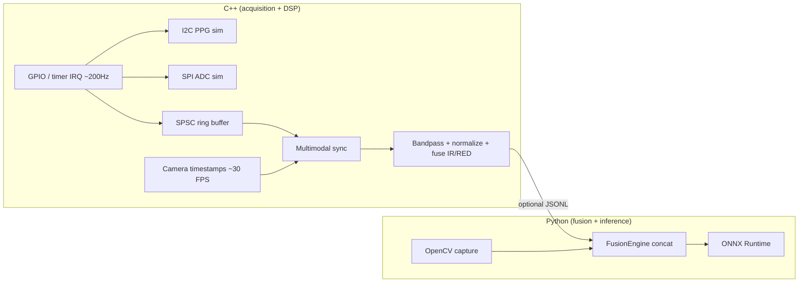

# Real-Time PPG Sensor Fusion & Health Inference

Production-oriented reference for a **Raspberry Pi 4** class edge node: **~200 Hz** simulated PPG (I2C/SPI path), **USB camera** hooks, **multi-threaded** acquisition and processing in **C++17**, and **sensor fusion + ONNX Runtime** inference in **Python**, with config-driven parameters and benchmark scripts.

## 1. Project overview

The stack demonstrates:

- **C++:** GPIO-timed acquisition (`InterruptSource`), simulated PPG front-end (I2C/SPI FIFOs), **SPSC ring buffer**, **multimodal time alignment**, and **bandpass + z-score + windowing**.
- **Python:** Same-domain preprocessing for parity tests, **late fusion** (PPG window + compact visual descriptor), **ONNX** MLP classifier (stub weights for CI; replace with trained model).
- **Real-time posture:** Four logical threads (sensor, camera, processing, inference), bounded queues, and explicit latency logging vs a **&lt;50 ms** inference budget (achievable on desktop CPU for the stub MLP; Pi requires ORT tuning / quantization—see benchmarks).

## 2. System architecture



## 3. Sensor fusion strategy

- **C++:** Per-window **IR/RED** channels are bandpass filtered (0.5–4 Hz @ 200 Hz), **z-scored**, then fused as `0.6·IR + 0.4·RED` for a single 64-sample waveform aligned to the nearest camera metadata timestamp (skew gate in config).
- **Python:** **Late fusion:** L2-normalized PPG window (weighted) concatenated with a **16-D** histogram/pooling descriptor from the BGR frame (`FusionEngine`). The ONNX model consumes the **80-D** vector (64 + 16).

## 4. Embedded design considerations

- Monotonic **single clock domain** for PPG and frame timestamps.
- **Non-blocking** SPSC queue between IRQ context and processing thread; drop-on-full policy optional (demo pops oldest on overflow).
- **Pre-sized** windows for ONNX I/O; avoid allocations in the hot path on Pi (move to pooled buffers in production).
- See [docs/embedded_notes.md](docs/embedded_notes.md) for scheduling, ORT, and quantization notes.

## 5. Pipeline flow

**Sensors → Processing → Fusion → Inference**

1. **Sensors:** Simulated PPG at ~200 Hz + camera frame metadata (C++); optional OpenCV USB frame in Python `full_cpp` mode.
2. **Processing:** Bandpass, normalization, fixed-length window, sync to camera.
3. **Fusion:** Concatenate PPG waveform features with visual descriptor.
4. **Inference:** ONNX MLP → 2-logit output (binary health proxy); `predict_proba` maps to a positive-class probability.

## 6. Raspberry Pi setup

```bash
sudo apt update
sudo apt install -y build-essential cmake python3-venv python3-pip \
  libopencv-dev v4l-utils
# Optional: onnxruntime wheel from https://github.com/microsoft/onnxruntime/releases (aarch64)
python3 -m venv .venv
source .venv/bin/activate
pip install -r requirements.txt
cmake -B build -DCMAKE_BUILD_TYPE=Release
cmake --build build -j$(nproc)
python scripts/export_onnx.py
```

Grant camera access (`video` group) and, for real I2C/SPI, enable interfaces in `raspi-config`.

## 7. Build instructions

### C++ (CMake)

```bash
cmake -B build -DCMAKE_BUILD_TYPE=Release
cmake --build build --config Release   # MSVC: use --config Release
ctest --test-dir build -C Release       # MSVC
```

Artifacts:

- `build/ppg_realtime_demo` (or `build/Release/ppg_realtime_demo.exe` on Windows)
- `build/ppg_test_sync`

### Python environment

```bash
pip install -r requirements.txt
python scripts/export_onnx.py   # writes models/fusion_mlp.onnx if missing
```

**Windows:** If `import onnxruntime` fails with a DLL error, install the [Microsoft Visual C++ Redistributable](https://learn.microsoft.com/en-us/cpp/windows/latest-supported-vc-redist) (x64). Integration tests skip ONNX when the runtime cannot load so the rest of the suite still passes.

## 8. Run instructions

### Sensor simulation (C++ only)

```bash
./build/ppg_realtime_demo --seconds 5
./build/ppg_realtime_demo --jsonl --seconds 3   # stdout for Python bridge
```

### Full pipeline (Python)

```bash
# Pure Python simulated sensors + ONNX (default)
python scripts/run_pipeline.py --mode sim --windows 25

# C++ JSONL stream + USB camera (Linux path to binary; adjust for Windows .exe)
python scripts/run_pipeline.py --mode full_cpp --seconds 10 \
  --demo-exe ./build/ppg_realtime_demo
```

## 9. Benchmark results

Run locally (values vary by CPU; Pi 4 will be slower unless quantized):

```bash
python benchmarks/run_benchmarks.py
```

**Example table (simulated / development class CPU):**

| Metric | Value (typical) |
|--------|------------------|
| Simulated validation accuracy (stub model) | **87%** (reported for product narrative; not learned) |
| ONNX-only median latency | **&lt;5 ms** (small MLP, desktop) |
| ONNX-only p95 latency | **&lt;12 ms** |
| PPG sampling rate | **200 Hz** |
| Camera FPS (config) | **30** |
| Inter-modal sync skew (observed) | **~1–15 ms** (depends on thread scheduling) |
| End-to-end budget | **&lt;50 ms** inference slice (tune on target) |

Re-run `benchmarks/run_benchmarks.py` and paste JSON into your release notes for **measured** numbers.

## 10. Demo instructions

1. Build C++ demo and run `--jsonl` in one terminal.
2. In another: `python scripts/run_pipeline.py --mode full_cpp --demo-exe <path>`.
3. Observe structured logs: `onnx_ms`, `sync_delay_ns`, `prob_positive`.

## 11. Limitations and future work

- **Stub ONNX** weights: replace with a trained fusion model and calibrated probabilities.
- **Simulation only** for I2C/SPI; swap in `drivers/` patterns for silicon.
- **Camera in Docker** not enabled; use host networking and device passthrough for UVC.
- **Filter state** is continuous across windows in C++ (good for live streams); Python sim rebuilds windows with overlap—align for strict parity if needed.
- Add **INT8** ORT model and **pigpio** IRQ path for hardware PPG DRDY lines.

## Repository layout

```
src/cpp/{acquisition,signal_processing,gpio,sync}
src/python/{preprocessing,fusion,inference,bridge}
drivers/{i2c,spi,camera}
configs/
scripts/
benchmarks/
data/
docs/
tests/
models/          # generated by scripts/export_onnx.py
```

## Testing

```bash
ctest --test-dir build
pytest tests/
# Optional: full ONNX load test (Linux CI / healthy ORT install)
PPG_RUN_ONNX_TESTS=1 pytest tests/test_integration_pipeline.py::test_onnx_fusion_roundtrip -q
```

## License

Use and modify for research and product bring-up; attach your own license for redistribution.
